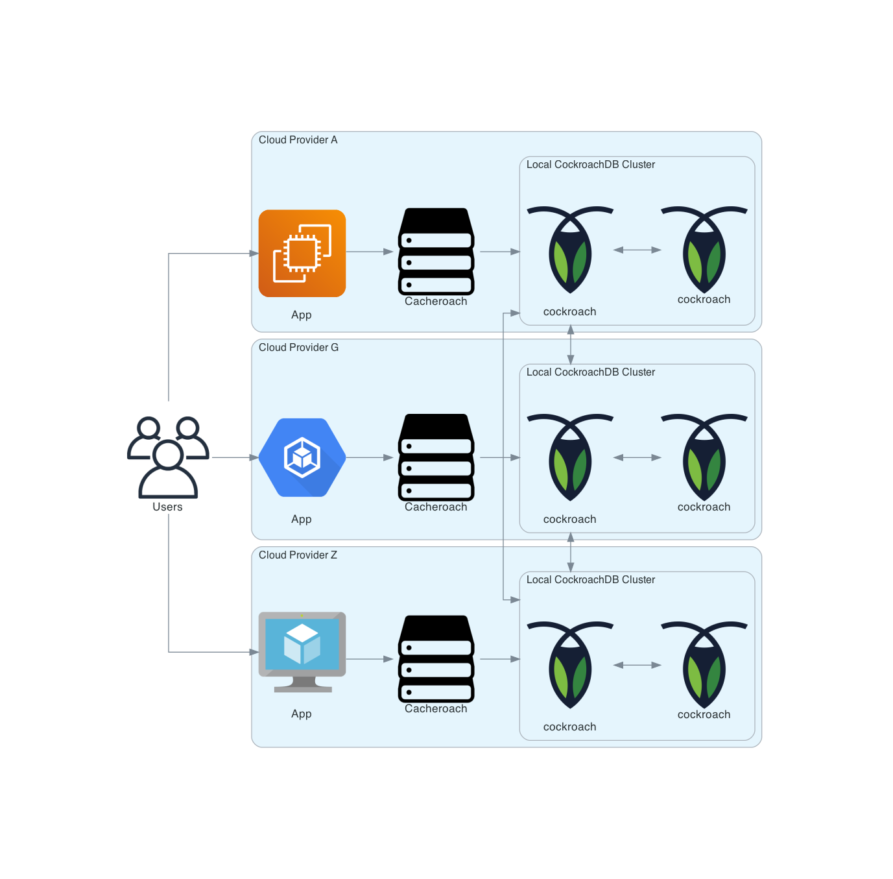

# Cacheroach

> I just want to serve five terabytes of data, across multiple cloud providers.

This is the beginning of a blog post; it needs a lot more work.

## Implementation details

### Data model

A CockroachDB cluster can easily hold many terabytes of data, however it is fundamentally designed
to service "Online Transaction Processing" (OLTP) and System-of-Record (SoR) use-cases. The
implementation choices necessary to excel in providing consistent and reliable transactions at scale
impose [certain limitations](https://www.cockroachlabs.com/docs/stable/known-limitations.html) on
the queries that can be effectively processed. The chief limitations to overcome when building a
file store are the maximum row (512 MiB) and transaction (64 MiB) sizes.

Cacheroach breaks files into content-addressable chunks of 512 KiB which are assembled into
content-addressable ropes. Ropes are then referenced by a filesystem abstraction which provides the
necessary metadata needed by clients. In this context, "content-addressable" means that we use the
cryptographic hash of the contents of a chunk or of a rope in order to identify it.

Cacheroach foregoes the typical approach of "one-request, one-transaction" due to the aforementioned
limits on the size on any given data transaction. Rather, we use an idempotent approach to most
data-storage operations. Writing the same chunk twice is effectively a no-op. We build on this when
manipulating ropes or performing operations on filesystem manifests. The use of
single-SQL-statement, implicit, transactions allows us to take advantage of CockroachDB's automatic
[transaction retry](https://www.cockroachlabs.com/docs/stable/advanced-client-side-transaction-retries.html)
mechanisms in cases where there is a transactional serialization conflict.

One extra layer of data organization is applied to chunks, ropes, and files: Tenancy. This allows a
single Cacheroach service to service multiple use-cases. The database schema also allows CockroachDB
zone configurations to be applied to better control where any given tenant's data lives.

## Security model

Cacheroach uses a "capability, delegate, target" approach to authorization.
A [Principal](./api/principal.proto) may have zero or more durable [Sessions](./api/session.proto)
which grant the principal the permission to perform operations within the system.

These sessions are exposed as signed [JWT tokens](https://jwt.io). Active sessions are maintained in
a table to facilitate occasional invalidation checks.

The API surface area uses a [declarative model](./api/capabilities.proto) to implement ACL checks in
a [centralized](./pkg/enforcer) manner. All access checks will have been performed by the time an
RPC method has been invoked. The return values are also checked and elided. An RPC call will be
rejected if a client "says" something that it's not allowed to "say," and it cannot "hear" anything
that it could not "say" later.

### Signed URLs

Cacheroach can generate durable signed URLs that allow an otherwise-unauthenticated client to
retrieve a file through Cacheroach's HTTP endpoint.

## Virtual Hosts

A tenant's filesystem can be bound to a virtual hostname and served over a regular HTTP endpoint.